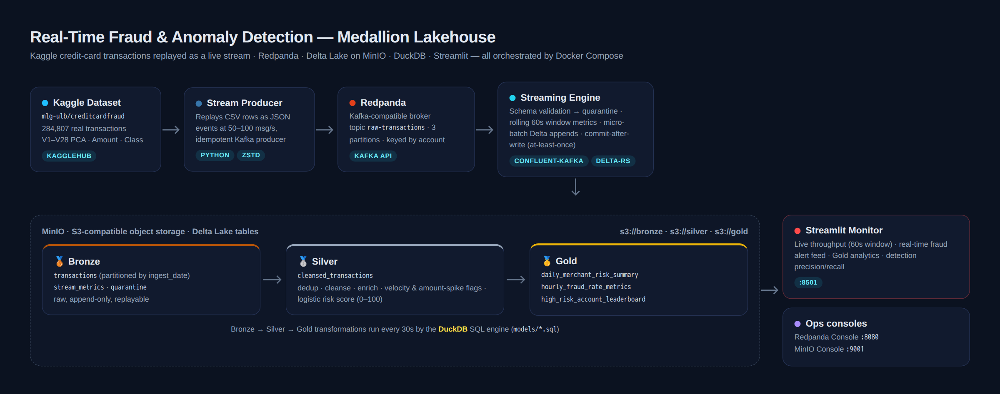
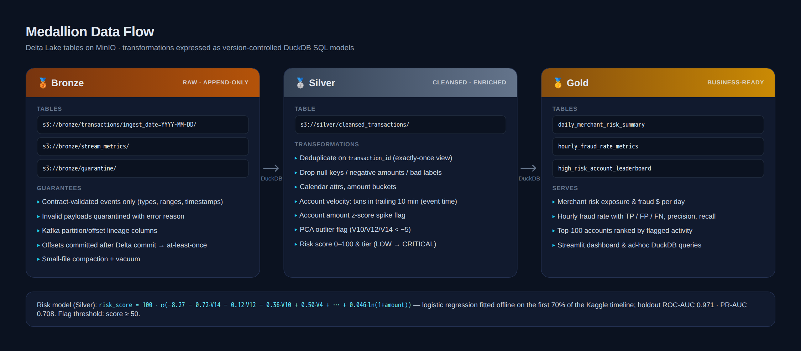
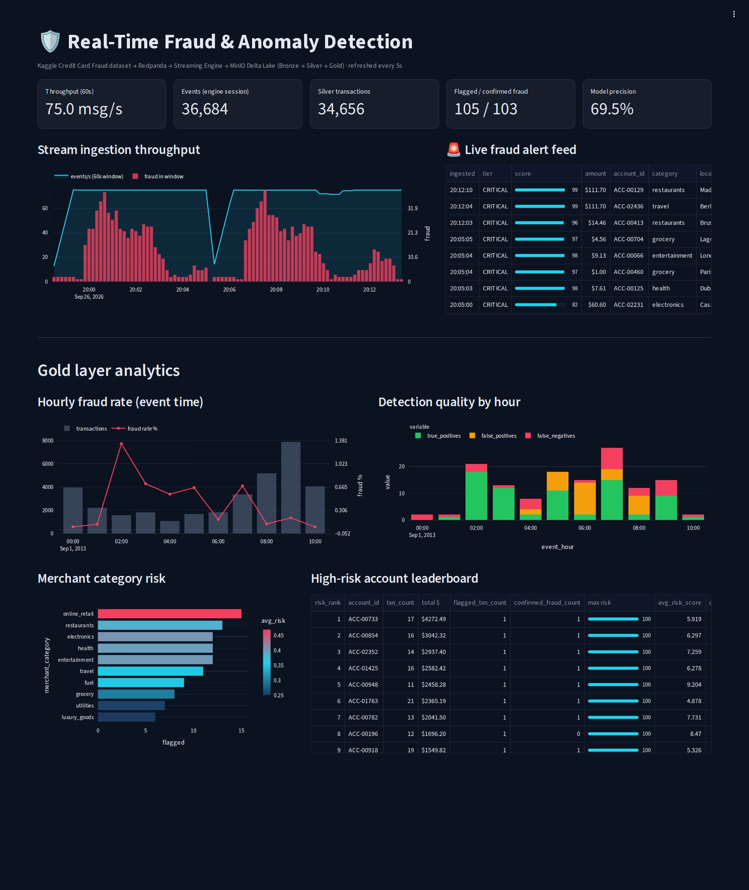
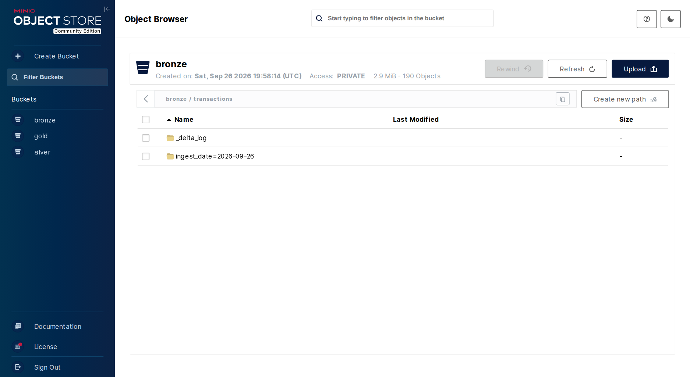

<div align="center">

# 🛡️ Real-Time Fraud & Anomaly Detection Pipeline
### Medallion Lakehouse Architecture · Streaming · Delta Lake · DuckDB

Real Kaggle credit-card transactions replayed as a live event stream, landed in a Delta Lake on object storage, refined through **Bronze → Silver → Gold**, scored for fraud risk and monitored in real time.


</div>



---

## Table of contents
1. [Executive overview](#-executive-overview)
2. [Data source — Kaggle Credit Card Fraud Detection](#-data-source--kaggle-credit-card-fraud-detection)
3. [Architecture](#-architecture)
4. [Medallion layers](#-medallion-layers)
5. [Risk scoring](#-risk-scoring)
6. [Screenshots](#-screenshots)
7. [Local deployment guide](#-local-deployment-guide)
8. [Configuration](#-configuration)
9. [Testing & quality](#-testing--quality)
10. [Repository structure](#-repository-structure)
11. [Design decisions & production notes](#-design-decisions--production-notes)

---

## 🎯 Executive overview

**Problem.** Card fraud is a streaming problem: a stolen card is typically drained within minutes, so batch detection that runs overnight arrives too late. Fraud teams need (1) low-latency ingestion of every authorisation event, (2) a trustworthy, replayable history for investigations and model training, and (3) business-level views of where risk is concentrating — by merchant, by hour and by account.

**Solution.** This project implements an end-to-end, fully containerised **streaming lakehouse**:

| Capability | Implementation |
|---|---|
| Event ingestion | Kaggle transactions replayed at a configurable 50–100 msg/s into **Redpanda** (Kafka API) |
| Stream processing | Python engine: schema contract enforcement, quarantine of bad records, **rolling 60-second window** metrics |
| Durable raw storage | **Delta Lake** tables on **MinIO** (S3), append-only Bronze with Kafka lineage columns |
| Refinement | **DuckDB** SQL models build Silver (dedup, cleanse, enrich, score) and Gold (business aggregates) every 30 s |
| Detection | Logistic risk model on the PCA features + rule-based velocity / amount-spike / outlier flags |
| Observability | **Streamlit** dashboard: throughput, live alert feed, precision/recall, merchant & account risk |

Everything starts with a single `docker compose up`.

---

## 📊 Data source — Kaggle Credit Card Fraud Detection

> **Dataset:** [Credit Card Fraud Detection — `mlg-ulb/creditcardfraud`](https://www.kaggle.com/datasets/mlg-ulb/creditcardfraud)
> Machine Learning Group, Université Libre de Bruxelles (ULB) & Worldline. Licensed under [ODbL 1.0](https://opendatacommons.org/licenses/odbl/1-0/).

| Property | Value |
|---|---|
| Records | **284,807** real card transactions made by European cardholders over two days in September 2013 |
| Fraud cases | **492** (0.172 %) — highly imbalanced, like production traffic |
| Features | `Time` (seconds since first txn), `V1`–`V28` (PCA-transformed, anonymised), `Amount`, `Class` (1 = fraud) |

**How it is used.** [`producer/transaction_generator.py`](producer/transaction_generator.py) resolves the CSV in this order and caches it in `./data/`:

1. `data/creditcard.csv` if it is already cached
2. **`kagglehub.dataset_download("mlg-ulb/creditcardfraud")`**, which works anonymously for this public dataset and uses your Kaggle credentials if they are configured
3. Fallback: a public mirror of the identical file hosted by TensorFlow (`storage.googleapis.com/download.tensorflow.org/data/creditcard.csv`), used if Kaggle is unreachable

Each CSV row becomes one JSON event on the `raw-transactions` topic. `Time` is anchored to `2013-09-01T00:00:00Z` to produce a reproducible `event_time`.

> **Transparency note: synthetic enrichment keys.** The Kaggle data is PCA-anonymised and has **no** merchant, account or location columns. To enable merchant- and account-level analytics, the producer derives *surrogate* keys (`account_id`, `merchant_id`, `merchant_category`, `location`) from a CRC32 hash of the row number. These keys are deterministic across replays and **statistically independent of the fraud label**, so they add no target leakage. All fraud signal comes from the real `V1–V28`, `Amount` and `Class` fields.

**Sample event** (row 541, a real fraud case; PCA features truncated)
```json
{
  "transaction_id": "1ef68bc3-5a63-5503-8a34-e59e62fb6c30",
  "source_row_id": 541,
  "replay_cycle": 0,
  "event_time": "2013-09-01T00:06:46+00:00",
  "time_offset_s": 406.0,
  "amount": 0.0,
  "is_fraud": 1,
  "account_id": "ACC-01359",
  "merchant_id": "MER-0178",
  "merchant_category": "luxury_goods",
  "location": "Lagos, NG",
  "produced_at": "2026-09-26T20:11:59.832346+00:00",
  "V1": -2.3122, "V2": 1.952, "V3": -1.6099, "V4": 3.9979, "...": "...", "V14": -4.2893, "...": "...", "V28": -0.1433
}
```

---

## 🏗️ Architecture

```
 ┌──────────────────┐   ┌───────────────────┐   ┌──────────────────────┐   ┌───────────────────────────┐
 │  Kaggle dataset  │   │  Stream producer  │   │       Redpanda        │   │     Streaming engine       │
 │ creditcard.csv   │──▶│ JSON @ 50-100 /s  │──▶│ topic raw-transactions│──▶│ schema validation          │
 │ 284,807 real txns│   │ idempotent, zstd  │   │ 3 partitions, keyed   │   │ rolling 60s window metrics │
 └──────────────────┘   └───────────────────┘   │ by account_id         │   │ micro-batch Delta appends  │
                                                └──────────────────────┘   │ commit offsets after write │
                                                                           └─────────────┬─────────────┘
                                                                                         │
 ┌───────────────────────────────────── MinIO (S3) · Delta Lake ─────────────────────────▼──────────────┐
 │                                                                                                        │
 │   🥉 s3://bronze                     🥈 s3://silver                        🥇 s3://gold                 │
 │   transactions/ (by ingest_date)──▶  cleansed_transactions/     ──▶  daily_merchant_risk_summary/     │
 │   stream_metrics/                    dedup · cleanse · enrich         hourly_fraud_rate_metrics/       │
 │   quarantine/                        flags · risk score               high_risk_account_leaderboard/   │
 │                        └──────── DuckDB SQL models, every 30 s ────────┘                               │
 └────────────────────────────────────────────────────────────────────────────────────┬─────────────────┘
                                                                                      │
                                                          ┌───────────────────────────▼──────────────┐
                                                          │  Streamlit monitor :8501                  │
                                                          │  throughput · live alerts · Gold analytics │
                                                          └───────────────────────────────────────────┘
```

| Service | Image / build | Port(s) | Role |
|---|---|---|---|
| `redpanda` | `redpandadata/redpanda:v24.2.18` | 19092 (Kafka), 18081, 18082 | Event broker |
| `redpanda-init` | same | – | Creates `raw-transactions` (3 partitions, 24 h retention) |
| `redpanda-console` | `redpandadata/console:v2.8.5` | [8080](http://localhost:8080) | Topic/consumer-group UI |
| `minio` | `cgr.dev/chainguard/minio` | 9000 (S3), [9001](http://localhost:9001) (console) | Object storage |
| `minio-init` | `amazon/aws-cli` | – | Creates `bronze`, `silver`, `gold` buckets |
| `producer` | `./producer` | – | Kaggle CSV → Redpanda |
| `streaming-engine` | `./streaming_engine` | – | Redpanda → Bronze Delta |
| `transformer` | `./lakehouse_transformations` | – | Bronze → Silver → Gold (DuckDB) |
| `dashboard` | `./dashboard` | [8501](http://localhost:8501) | Streamlit monitoring UI |

---

## 🥇 Medallion layers



### 🥉 Bronze: raw, append-only (`streaming_engine/streaming_consumer.py`)
* **Contract enforcement:** required fields, types, finiteness, `amount ≥ 0`, `is_fraud ∈ {0,1}` and parseable timestamps are all checked. Violations go to `s3://bronze/quarantine` with the error reason and the raw payload.
* **Rolling 60-second window:** a processing-time sliding window computes events/s, fraud count, amount and invalid count, and persists them every 10 s to `s3://bronze/stream_metrics`.
* **Delivery semantics:** batches flush every 10 s or 2,000 records. Kafka offsets are committed **only after** the Delta commit succeeds, which gives at-least-once delivery. Lineage columns (`kafka_partition`, `kafka_offset`, `ingested_at`) are kept.
* **Maintenance:** the engine is the table's single writer, so it periodically compacts small streaming files (`optimize.compact`) and vacuums them.

### 🥈 Silver: `silver_cleansed_transactions.sql`
* **Deduplication:** one row per `transaction_id` (`QUALIFY row_number()`), which turns at-least-once delivery and producer restarts into an exactly-once view.
* **Cleansing:** drops null keys, negative amounts and out-of-contract labels.
* **Enrichment:** `event_date`, `event_hour`, `hour_of_day`, `amount_bucket`, account transaction velocity over a trailing 10-minute event-time window (`RANGE BETWEEN INTERVAL 10 MINUTES PRECEDING`), and the account amount z-score.
* **Flags:** `velocity_flag` (≥ 3 txns / 10 min), `high_amount_flag` (≥ $1,000 ≈ p99), `amount_spike_flag` (z > 3), `pca_outlier_flag` (V10/V12/V14 < −5).
* **Risk:** `risk_score` (0–100), `risk_tier` (LOW / MEDIUM / HIGH / CRITICAL) and `is_flagged` (score ≥ 50).

### 🥇 Gold: `gold_fraud_metrics.sql`
| Table | Grain | Key metrics |
|---|---|---|
| `daily_merchant_risk_summary` | day × merchant | txn count, total & fraud $, fraud rate %, flagged count, avg/max risk |
| `hourly_fraud_rate_metrics` | event hour | fraud rate %, TP / FP / FN, **precision**, **recall**, velocity & high-amount alerts |
| `high_risk_account_leaderboard` | account (top 100) | risk rank, flagged & confirmed fraud, max/avg risk, distinct merchants & locations |

SQL models live in plain `.sql` files. Gold statements are separated by `-- name: <table>` markers and each is materialised to `s3://gold/<table>`.

---

## 🧠 Risk scoring

The Silver layer embeds a **logistic regression** fitted offline on the Kaggle data. The strongest separating components are V14, V10, V4 and V12:

```
risk_score = 100 · σ( −8.2705 − 0.7211·V14 − 0.1225·V12 − 0.3587·V10 + 0.0629·V17 + 0.5034·V4
                      + 0.0864·V11 + 0.1247·V3 − 0.1419·V16 − 0.0039·V7 + 0.046·ln(1 + amount) )
```

**Evaluation protocol:** a time-based split was used, with the model trained on the first 70 % of the timeline and evaluated on the last 30 % (85,439 transactions, 108 frauds).

| Metric (holdout) | Value |
|---|---|
| ROC-AUC | **0.971** |
| PR-AUC (average precision) | **0.708** |
| Precision / recall @ score ≥ 50 | 0.85 / 0.46 |
| Precision / recall @ score ≥ 30 | 0.71 / 0.52 |

The dashboard also shows live precision and recall per hour, because the `Class` label travels with every event as ground truth. Because the model is scored on the full stream, which includes its own training window, live figures are slightly optimistic compared with the holdout numbers above.

---

## 📸 Screenshots

These are real captures of the running stack, taken with headless Chromium by [`scripts/capture_assets.py`](scripts/capture_assets.py).

### Streamlit monitoring dashboard


### MinIO object storage: Bronze Delta table (`_delta_log` + `ingest_date` partitions)


Resulting bucket layout:
```
bronze/
├── transactions/
│   ├── _delta_log/00000000000000000000.json …
│   └── ingest_date=2026-09-26/part-00001-….parquet
├── stream_metrics/
└── quarantine/
silver/
└── cleansed_transactions/
gold/
├── daily_merchant_risk_summary/
├── hourly_fraud_rate_metrics/
└── high_risk_account_leaderboard/
```

---

## 🚀 Local deployment guide

**Prerequisites:** Docker Desktop / Docker Engine with Compose v2, about 4 GB RAM, and ports 8080, 8501, 9000, 9001, 18081, 18082 and 19092 free.

```bash
# 1. Clone
git clone https://github.com/ahmedchmourk/fraud-detection-lakehouse.git
cd fraud-detection-lakehouse

# 2. (optional) configure rate / Kaggle credentials
cp .env.example .env

# 3. Build and launch the whole platform
docker compose up -d --build

# 4. Watch the pipeline come alive
docker compose logs -f producer streaming-engine transformer
```

On first start the producer downloads the dataset (~150 MB) into `./data/`. Expect Bronze commits within ~10 s and the first Gold tables within ~30 s.

| UI | URL | Credentials |
|---|---|---|
| Streamlit dashboard | http://localhost:8501 | – |
| Redpanda Console | http://localhost:8080 | – |
| MinIO Console | http://localhost:9001 | `minioadmin` / `minioadmin` |

**Useful commands**
```bash
# Inspect the topic
docker exec -it redpanda rpk topic consume raw-transactions -n 1

# One-off transformation run
docker compose run --rm transformer python transform_silver_gold.py --once

# Ad-hoc SQL on Gold from the host (pip install duckdb deltalake)
python -c "
from deltalake import DeltaTable; import duckdb
opts={'AWS_ENDPOINT_URL':'http://localhost:9000','AWS_ACCESS_KEY_ID':'minioadmin','AWS_SECRET_ACCESS_KEY':'minioadmin','AWS_REGION':'us-east-1','AWS_ALLOW_HTTP':'true'}
t=DeltaTable('s3://gold/hourly_fraud_rate_metrics',storage_options=opts).to_pyarrow_dataset()
print(duckdb.sql('select event_hour, txn_count, fraud_rate_pct, precision, recall from t order by 1').df())"

# Regenerate README screenshots (stack must be running)
docker run --rm --network fraud-lakehouse_default -v "$PWD":/w -w /w \
  mcr.microsoft.com/playwright/python:v1.55.0-noble \
  sh -c "pip install -q playwright==1.55.0 && python scripts/capture_assets.py"

# Stop (keep data) / full reset
docker compose down
docker compose down -v && rm -f data/.producer_checkpoint.json
```

---

## ⚙️ Configuration

| Variable | Default | Service | Description |
|---|---|---|---|
| `MSG_RATE` | `75` | producer | Replay rate in messages/second |
| `LOOP_FOREVER` | `true` | producer | Restart the dataset with a new `replay_cycle` when exhausted |
| `RESUME_FROM_CHECKPOINT` | `true` | producer | Resume from `data/.producer_checkpoint.json` after restarts |
| `KAGGLE_USERNAME` / `KAGGLE_KEY` | – | producer | Optional Kaggle API credentials for `kagglehub` |
| `BATCH_MAX_SECONDS` / `BATCH_MAX_RECORDS` | `10` / `2000` | streaming-engine | Micro-batch flush triggers |
| `WINDOW_SECONDS` | `60` | streaming-engine | Rolling window length |
| `COMPACT_EVERY_N_FLUSHES` | `60` | streaming-engine | Bronze compaction cadence |
| `TRANSFORM_INTERVAL_SECONDS` | `30` | transformer | Silver/Gold refresh interval |
| `DASHBOARD_REFRESH_SECONDS` | `5` | dashboard | Live panel refresh interval |

---

## ✅ Testing & quality

```bash
pip install -r requirements-dev.txt
ruff check .
pytest -v
```

The suite (19 tests) runs against a fixture of **300 real rows** from the Kaggle dataset and covers:
* event construction, deterministic IDs, event-time anchoring, dataset caching, checkpoint/resume
* schema validation (7 invalid-payload cases), rolling-window eviction, and quarantine routing with commit-after-write
* Silver deduplication, score bounds, fraud/legit separation on real data, Gold model shapes, and Delta-compatible types

---

## 📁 Repository structure

```
.
├── docker-compose.yml               # Redpanda, MinIO, producer, engine, transformer, dashboard
├── data/                            # Cached Kaggle CSV (git-ignored) + producer checkpoint
├── producer/
│   ├── transaction_generator.py     # Kaggle CSV → JSON events → Redpanda
│   ├── Dockerfile
│   └── requirements.txt
├── streaming_engine/
│   ├── streaming_consumer.py        # validation, 60s window, Bronze Delta writer
│   ├── Dockerfile
│   └── requirements.txt
├── lakehouse_transformations/
│   ├── transform_silver_gold.py     # DuckDB runner: Bronze → Silver → Gold
│   ├── models/
│   │   ├── silver_cleansed_transactions.sql
│   │   └── gold_fraud_metrics.sql
│   ├── Dockerfile
│   └── requirements.txt
├── dashboard/
│   ├── app.py                       # Streamlit monitor
│   ├── .streamlit/config.toml
│   ├── Dockerfile
│   └── requirements.txt
├── assets/                          # README images (+ HTML sources for the diagrams)
├── scripts/capture_assets.py        # Playwright renderer for README assets
└── tests/                           # pytest suite + real-data fixture
```

---

## 🧭 Design decisions & production notes

* **Redpanda instead of Kafka + ZooKeeper:** a single binary with the Kafka API gives the same client code with a much smaller local footprint.
* **Delta Lake via `delta-rs`:** ACID appends, time travel and compaction without a JVM or Spark. DuckDB reads the Delta snapshots as Arrow datasets, so readers never see partially written batches.
* **Single-writer tables:** each Delta table has exactly one writer (engine → Bronze, transformer → Silver/Gold), which makes `AWS_S3_ALLOW_UNSAFE_RENAME` safe. With multiple writers, use a DynamoDB lock or S3 conditional writes.
* **Full refresh Silver/Gold:** simple and correct at this data volume. At production scale, switch to incremental `MERGE` keyed on `transaction_id` with a watermark on `ingested_at`.
* **MinIO image:** MinIO stopped publishing community images to Docker Hub/Quay in 2025, so this stack uses Chainguard's maintained build (`cgr.dev/chainguard/minio`), with an `aws-cli` sidecar that creates the buckets.
* **Security:** the default credentials are for local development only. Override them in `.env` and never expose ports 9000/9001 publicly.
